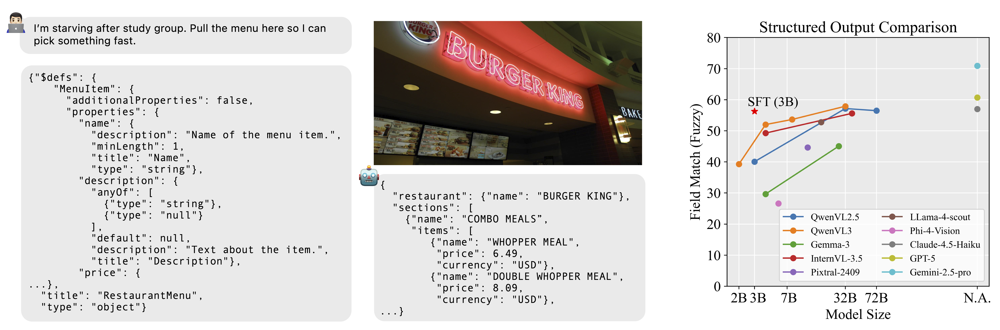

# [SO-Bench: A Structural Output Evaluation of Multimodal LLMs (CVPR 2026)](https://arxiv.org/abs/2511.21750)

<font size=7><div align='center' > [[📖 Paper](https://arxiv.org/abs/2511.21750)]  </div></font>



SO-Bench is a benchmark designed to evaluate multimodal large language models (MLLMs) on their ability to generate schema-compliant structured outputs grounded in visual inputs. The benchmark targets realistic agentic settings where model outputs must not only be semantically correct, but also strictly conform to predefined JSON schemas. SO-Bench spans four visual domains—UI screens, natural images, documents, and charts—and is constructed from over 6.5K diverse schemas paired with 1.8K high-quality image–schema instances, all human-verified for accuracy. We hope this benchmark serves as a catalyst for advancing research and training methods that improve visual structured output capabilities in MLLMs.

## Getting Started
### Step 1: Download and prepare the images
Run the following command to download and prepare the datasets:
```bash
python download.py
```
All data will be saved to ml-sobench/data/{dataset_name}.
In total, we download 10 datasets covering the full SO-Bench evaluation suite.

### Step 2: Generate the evaluation file

Unzip `data/labels.zip`, which contains the ground-truth evaluation annotations. Then run:
```bash
python convert_to_eval_jsonl.py \
  --input_dir=data/labels \
  --output_file=data/so_bench_eval.jsonl \
  --num_threads=16
```
This step converts the annotations into a unified JSONL format that can be directly used for OpenAI-style model inference and evaluation.

Note: We filter out 20 label entries that were used in the original paper due to corrupted or missing images. As a result, the evaluation results produced by this codebase may differ slightly from the numbers reported in the paper.

### Step 3: Run inference and report evaluation results
The evaluation pipeline is implemented in [eval.py](eval.py)
For a complete, runnable example of the inference and evaluation workflow, please refer to [demo.ipynb](demo.ipynb)


## License
This software and accompanying data and models have been released under the following licenses:
- Code: [Apple Sample Code License (ASCL)](./LICENSE.md) 
- Data: [CC-BY-NC-ND](./LICENSE_DATA.md) [Deed](https://creativecommons.org/licenses/by-nc-nd/4.0/)

## Citation
```
@misc{feng2025so,
      title={SO-Bench: A Structural Output Evaluation of Multimodal LLMs},
      author={Feng, Di and Ma, Kaixin and Nan, Feng and Chen, Haofeng and Zhai, Bohan and Griffiths, David and Gao, Mingfei and Gan, Zhe and Verma, Eshan and Yang, Yinfei and Chen, Zhifeng, and Dehghan, Afshin},
      year={2025},
      eprint={2511.21750},
      archivePrefix={arXiv},
      primaryClass={cs.CV},
      url={https://arxiv.org/abs/2511.21750},
}
```
